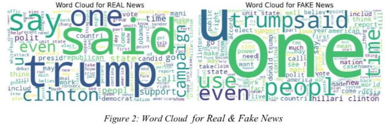

# 📰 Fake News Detection using Machine Learning

## 📌 Project Overview
This project focuses on **detecting fake news articles** using **Natural Language Processing (NLP)** and **machine learning classification models**.  
The goal is to automatically classify news articles as **REAL or FAKE** based on their textual content, addressing the growing challenge of misinformation on digital platforms.

The project follows a structured data mining workflow including preprocessing, feature extraction, model training, and comparative evaluation.

---

## 🧠 Problem Statement
With the rapid spread of information through social media and online news platforms, manually verifying news authenticity has become increasingly difficult.  
This project aims to develop a **data-driven solution** that can effectively distinguish between real and fake news articles using text-based features.

---

## 📂 Dataset Description
- Source: Kaggle (Fake News Dataset)
- Size: 6,335 news articles
- Features:
  - `title`: News headline
  - `text`: Full article content
  - `label`: REAL or FAKE

The dataset is balanced across both classes.

---

## 🧹 Data Preprocessing
The following NLP preprocessing steps were applied:
- Text normalization (lowercasing)
- Punctuation removal
- Contraction expansion
- Stopword removal (NLTK)
- Stemming using Porter Stemmer
- Removal of irrelevant columns

These steps reduced noise and improved feature quality.

---

##  Text Visualization
Word clouds were generated to visualize the most frequent terms in **REAL** and **FAKE** news articles after preprocessing.

### Word Cloud Preview

---

## 🔍 Feature Extraction
- **TF-IDF (Term Frequency–Inverse Document Frequency)**
- N-grams (bigrams) were used to capture contextual word patterns
- High-frequency common terms were filtered to improve model performance

---

## 🤖 Machine Learning Models
The following classifiers were implemented and compared:

- **Random Forest**
- **Random Forest with N-grams**
- **Support Vector Machine (SVM)**
- **k-Nearest Neighbors (KNN)**
- **Naive Bayes**

---

## 📊 Model Evaluation
Models were evaluated using:
- Accuracy
- Precision
- Recall
- F1-score
- Confusion Matrix

### 🏆 Best Performing Model
- **Support Vector Machine (SVM)**
  - Accuracy: **93%**
  - Balanced precision, recall, and F1-score for both classes

---

## 🛠️ Tools & Technologies
- Python
- Pandas, NumPy
- Scikit-learn
- NLTK
- TF-IDF Vectorizer
- Matplotlib, Seaborn
- Jupyter Notebook

---
